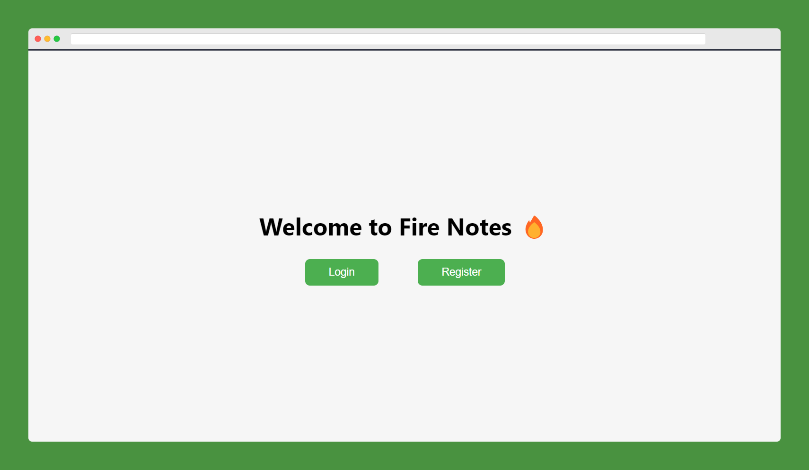

# Fire Notes 🔥

Fire Notes is a note-taking application that uses Firebase as its backend database. Users can create, and delete notes, and all changes are automatically saved to the Firebase database. The application allows users to authenticate with their Google accounts, and only authenticated users are able to access their own notes. The user interface is simple and intuitive, with a list of notes on the left and the selected note's contents displayed on the right. The application is built using React and the Firebase JavaScript SDK, and is designed to be scalable and easy to maintain.

## Author

**Sanchit Bajaj**

## Technology used

- React TypeScript
- Firebase Auth
- Firebase Firestore
- Redux Toolkit

## Installation guide

Clone this repository using the below link

```bash
git clone https://github.com/Sanchitbajaj02/fire-notes.git
```

After cloning into your local machine, open the terminal and type the following command to install the dependencies

```bash
npm install
```

Now, to start the application, type this command:

```bash
npm start
```

## Screenshots


